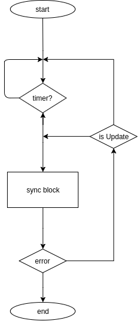
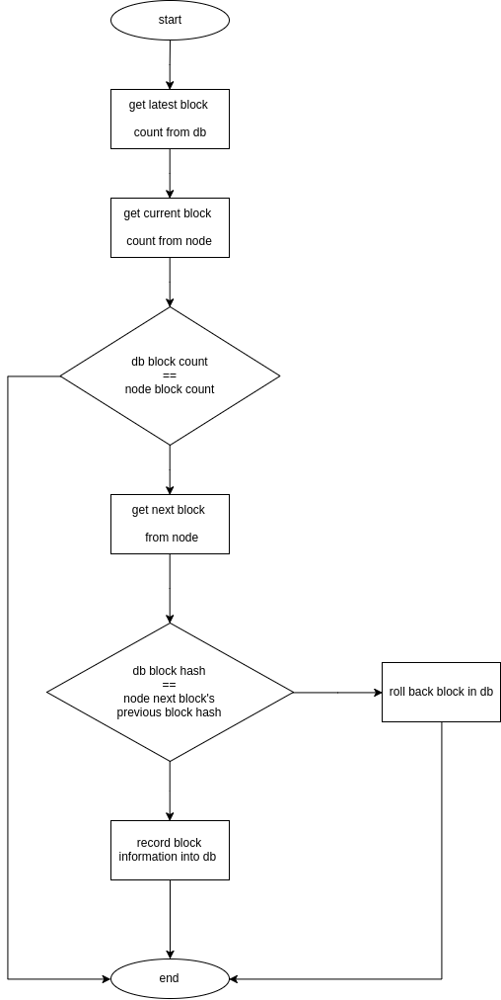

# Blockcenter 区块链中心化钱包后端服务器

## 软件简介

区块链钱包可以允许用户实现密钥管理、账户管理和资产管理的功能。当前市面上有许多款不同类型的钱包，包括中心化的和去中心化的，全节点钱包和轻钱包。这款软件实现了一个中心化的钱包后端服务器，服务器只存储区块链上公有的区块数据，并帮忙构建和发送交易。私钥仍然保管在用户端，从而在中心化的情况下仍能保证用户的资产安全——并且由于用户端只需要关心保管私钥并对交易进行签名，而不需要同步和存储区块数据，用户端的实现可以十分轻量。统一化的接口设计也使得多种平台的钱包客户端可以容易地得到实现，包括手机端和浏览器插件端。

## 软件特性

+ 只存储区块链上公有的区块数据而不存储私钥，从而保障用户的资产安全。
+ 存储了构建交易所需要的信息，帮忙构建交易，从而使客户端可以得到轻量实现。这带来两个好处，一个是用户不需要耗费时间以及存储空间进行区块同步，解决了传统全节点钱包使用体验不佳的痛点；另一个是客户端的实现不需要进行交易的解析，降低了开发成本。
+ 可以支持大量并发交易请求。

## 功能和关键流程设计

### 登陆

Blockcenter 设计的目的是建立一个开放的、易于接入的后端服务器，所以不需要严苛的登陆过滤。理论上，任何拥有密钥的用户都会被允许进行接入。这样，区块链用户就可以方便地与服务器交互进行资产管理和发送交易。

用户第一次使用 blockcenter 后端服务时，需要提供一个公钥以进行注册。这个公钥是与用户的私钥（用户使用钱包时需要生成一个私钥）对应产生的。blockcenter 后端服务器会为用户生成一个用户 ID，用户以后每次的操作需要通过这个用户 ID 来进行。

### 资产管理

用户可以通过 Blockcenter 提供的接口来进行资产管理。其中最重要的几个功能包括：列出账户余额、列出账户相关的交易、构建交易和发送交易的功能。要实现列出账户余额、列出账户相关的交易、构建交易这几个功能，就需要获取用户相关的信息，包括相关的转账记录、地址下的可花费余额等。这就需要进行区块信息扫描，并进行用户信息的关联。

而发送交易则会在下文中进行进一步地介绍。

### 扫描区块信息

扫描区块模块主体如下，定时判断区块数据是否有更新：有的话继续同步，否则过一段时间后再进行检查。




sync block 主体逻辑流程图如下。



sync block 判断是否有新的区块，并且是否发生了分叉。
如果存在新的区块并且没有分叉，证明需要同步该区块，于是读取该区块并把相关信息在数据库中处理更新。
否则进行区块数据回滚。


新增区块信息主体逻辑流程图如下。


区块数据回滚主体逻辑流程图如下。


### 构建交易
### 发送交易

```
登陆界面
主界面

软件结构图
流程图
逻辑框图


总体设计
接口设计
模块名称功能
函数名称功能
算法
运行设计
```

